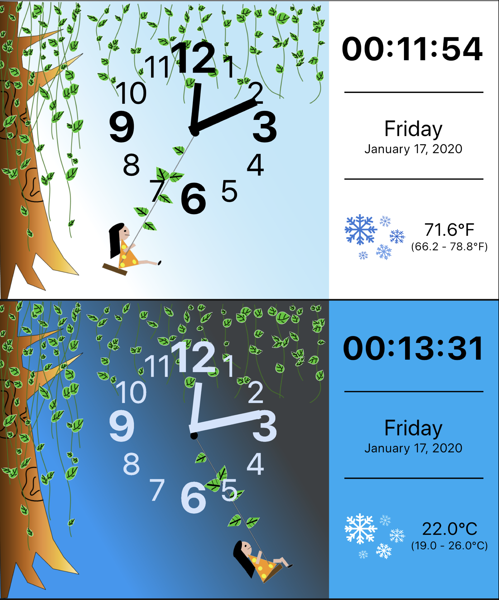
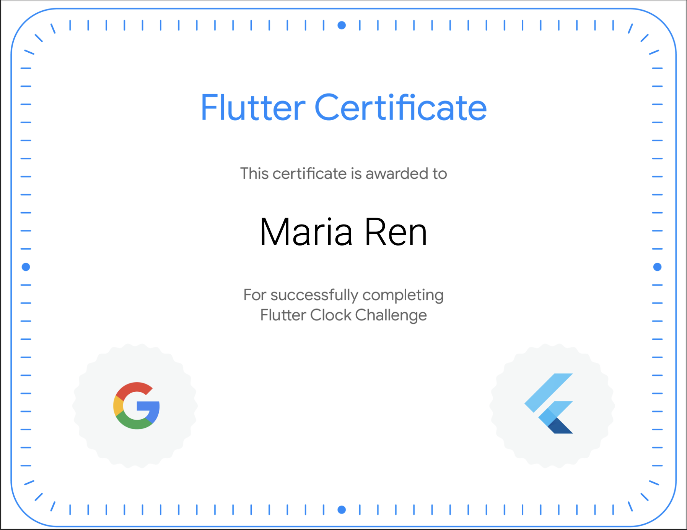

# Maria Ren Clock

## This app is designed by Maria Ren for the Flutter Clock Challenge Competition.

## Note To Judges: 
#### * Please test on iOS device. This app is developed on iPhone 11 Emulator iOS 13.2.2. Best performance and result is achieved using iOS devices.
#### * Please use `flutter run` instead of `flutter create .` when running project (I made some edits in the iOS and Android folders so I didn't delete them during project cleanup.

## Special Features:
- **Animations** : Created using Flare animation.
- **Accessibility** : Accessibility will read through all important information including time,
  date, weather etc. VoiceOver will start once user taps screen, and will automatically update
  every minute with the accurate information.
- **Convenient Time Reading** : Features both analog and digital clock for convenient time reading.
- **Original Artwork** : All assets, images, and animations are drawn by myself.
- **Multiple App Theme** : Has a light theme and a dark theme.
- **Fun Weather Icons** : Supports updating weather condition icons.
- **Multiple Time Formats** : Supports 24 hour format.
- **Multiple Temperature Units** : Supports multiple temperature units (celsius, fahrenheit).
- **Lots of Useful Information** : Displays data including time, weekday, date, year, weather condition,
  temperature, temperature range etc.

## Testing Devices and Emulators:

#### [Devices]
- iPad Air (1st generation) iOS 12.4.4
- iPhone 6s iOS 13.3

####  [Emulators - all with iOS 13.2.2]
- iPhone 11 -  _(App developed on this emulator)_.
- iPhone 6s
- iPhone 6s+
- iPhone 8
- iPhone 8+
- iPhone 11 Pro
- iPhone 11 Pro Max
- iPad Pro (9.7 inch)
- iPad Pro (12.9 inch)
- iPad (7th generation)
- iPad Pro (11 inch)
- iPad Air (3rd generation)

## Demo:
- Please see the file `Maria_Ren_Flutter_Clock_Demo.mp4` for a quick demo.

#### For License information please see file LICENSE (including BSD for code, Apache 2.0 for assets,and OFL for fonts licenses).

    

    

