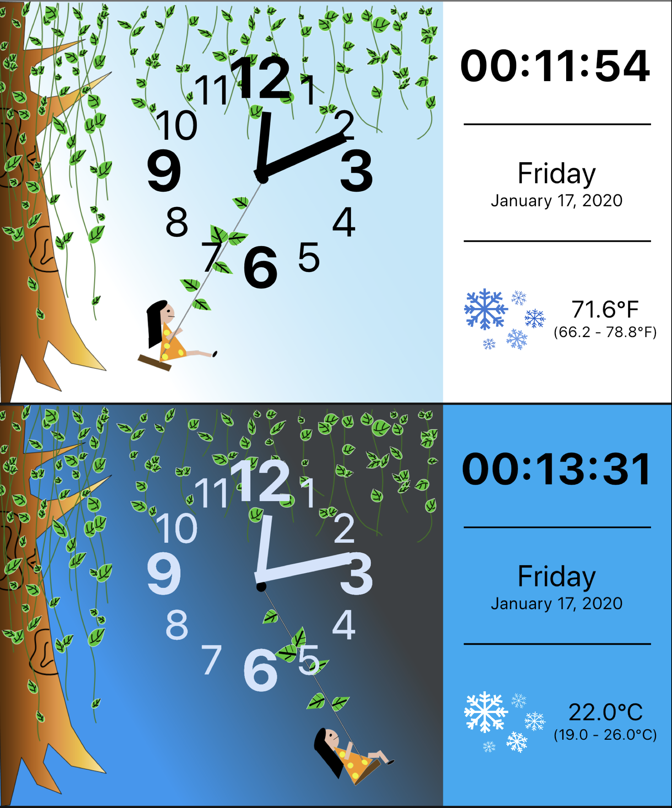

# Maria Ren Clock

This app is designed by Maria Ren for the Flutter Clock Challenge Competition.

Special Features:
- Animations created using Flare animation.
- Features both analog and digital clock for convenient time reading.
- All assets, images, and animations are drawn by myself.
- Has a light theme and a dark theme.
- Supports updating weather condition icons.
- Supports 24 hour format.
- Supports multiple temperature units (celsius, fahrenheit).
- Displays data including time, weekday, date, year, weather condition, temperature,
  temperature range etc.
- Accessibility tested.
- Created, tested and optimized on iPhone 11 Pro - 13.2.2 emulator

Test Results:
[Devices]
- iPad Air (1st generation) iOS 12.4.4
- iPhone 6s iOS 13.3

[Emulators - all with iOS 13.2.2]
- iPhone 11 Pro -  (App developed on this emulator, best results and performance).
- iPhone 6s
- iPhone 6s+
- iPhone 8
- iPhone 8+
- iPhone 11
- iPhone 11 Pro
- iPhone 11 Pro Max
- iPad Pro (9.7 inch)
- iPad Pro (12.9 inch)
- iPad (7th generation)
- iPad Pro (11 inch)
- iPad Air (3rd generation)

